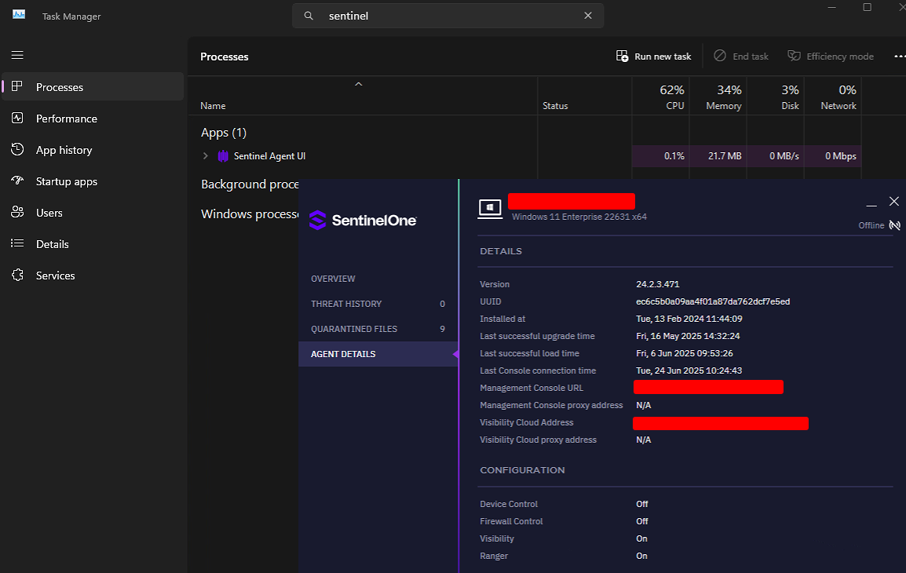

# SentinelOne WDAC Policy



## Requirements

- Local administrator rights are required

## Usage

To block SentinelOne from spawning after reboot, add the CIP file to the following directory:

```
C:\Windows\System32\CodeIntegrity\Active
```

This will prevent SentinelOne from executing after system restart.
